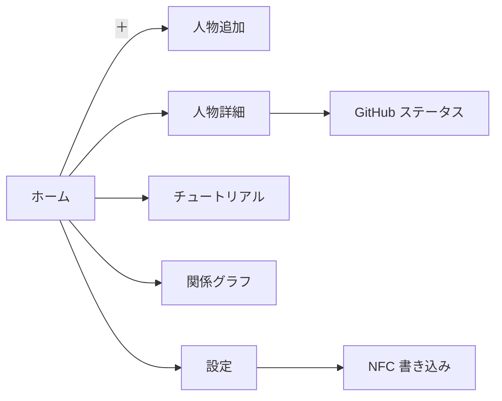
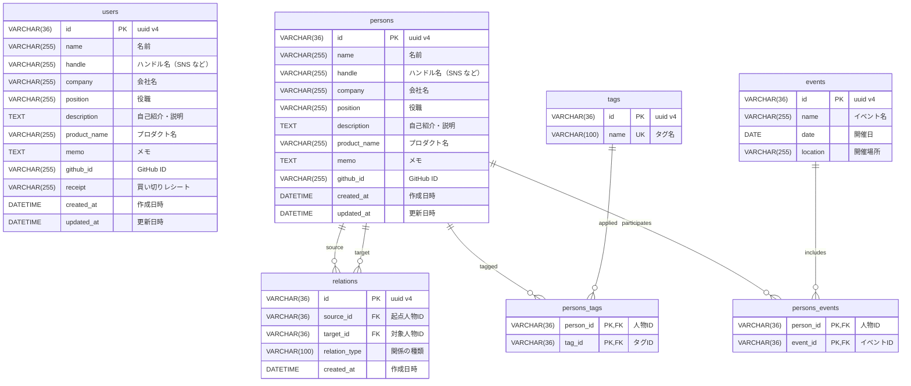

# ReMeet

ミートアップであった人を記録するアプリ

# ReMeet 要件定義書（v2.1 ― 改訂版）

---

## 追加:アプリのカラーについて

- テーマ:ライト
  - 白バックグラウンド
  - 黒文字
  - button
    - 黒バックグラウンド
    - 白文字
- GitHub
  - 全て GitHub のカラーを使用する

## 1. プロジェクト概要

- **アプリ名**：ReMeet
- **目的**

  1. 出会った人物のプロフィール・SNS 情報を一元管理
  2. タグで人物・イベントを整理し高速にフィルタリング
  3. NFC カードを用いたワンタップ登録／呼び出し
  4. MindNode 風グラフで人間関係・共通点を可視化
  5. GitHub など外部 SNS の最新情報をキャッシュ付きで取得

- **想定ユーザー**
  - 技術カンファレンス・勉強会に参加するエンジニア
  - 新しいガジェット（NFC 名刺）に抵抗がない層
  - 拡散チャネルは口コミと SNS

---

## 2. ユーザーストーリー（抜粋）

| ID  | ストーリー                                                     | 受け入れ基準                                    |
| --- | -------------------------------------------------------------- | ----------------------------------------------- |
| S1  | NFC カードをかざすと登録画面が開き、カード ID が自動入力される | 1 秒以内に画面遷移し、ID がフォームに表示される |
| S2  | 人物登録時に複数タグを追加し、後でタグ検索できる               | タグチップの追加・削除 UI、AND/OR フィルタ      |
| S3  | ホームで名前・会社・タグから高速検索できる                     | 入力 200 ms 以内に結果リストが更新              |
| S4  | GitHub ID からスター数・最終更新を取得し、24 h キャッシュ      | オフライン時は前回キャッシュ表示                |
| S5  | グラフで共通イベントやタグで人物が自動接続される               | ノード数 200 で FPS 40 以上                     |
| S6  | 設定画面で自分のプロフィール編集と NFC 書き込みができる        | 書き込み成功率 95 % 以上                        |

---

## 3. 機能一覧

| カテゴリ       | 機能                                                                                           |
| -------------- | ---------------------------------------------------------------------------------------------- |
| 共通           | SQLite 暗号化 DB、ダーク／ライトテーマ、自動バックアップ（iOS CloudKit / Android Auto Backup） |
| タグ管理       | タグ CRUD、タグマージ、重複検知                                                                |
| NFC 連携       | 読み取り時フォアグラウンド起動、上書き確認ダイアログ、書き込みロールバック                     |
| ホーム         | 人物リスト（仮想リスト）、高速全文検索、並び替え                                               |
| チュートリアル | 初回起動フロー、NFC 操作アニメーション                                                         |
| 人物登録／編集 | 動的フォーム生成（Schema → react-hook-form ＋ zod）、必須項目バリデーション                    |
| GitHub 画面    | GraphQL API でバルク取得、24 h キャッシュ、自動リフレッシュ                                    |
| グラフ画面     | Skia Canvas ＋レイアウト WebWorker、ピンチズーム／パン、ノードドラッグ                         |
| 設定           | ユーザープロフィール、NFC 書き込み、テーマ・ロケール                                           |

---

## 4. 画面遷移図（Mermaid）

---

## 5. データモデル（SQLite テーブル定義）

### 5.0 ER 図

### 5.1 users （UserProfile テーブル）

| カラム名     | データ型     | 制約                               | 説明                                                     |
| ------------ | ------------ | ---------------------------------- | -------------------------------------------------------- |
| id           | VARCHAR(36)  | PRIMARY KEY                        | uuid v4                                                  |
| name         | VARCHAR(255) | NOT NULL                           | 名前                                                     |
| handle       | VARCHAR(255) | NULL                               | ハンドル名（SNS など）                                   |
| company      | VARCHAR(255) | NULL                               | 会社名                                                   |
| position     | VARCHAR(255) | NULL                               | 役職                                                     |
| description  | TEXT         | NULL                               | 自己紹介・説明                                           |
| product_name | VARCHAR(255) | NULL                               | プロダクト名                                             |
| memo         | TEXT         | NULL                               | その人の特徴を書く(どこであったかは events table にかく) |
| github_id    | VARCHAR(255) | NULL                               | GitHub ID                                                |
| receipt      | VARCHAR(255) |                                    | 買い切りを買ったかどうかのレシートを保持する             |
| created_at   | DATETIME     | NOT NULL DEFAULT CURRENT_TIMESTAMP | 作成日時                                                 |
| updated_at   | DATETIME     | NOT NULL DEFAULT CURRENT_TIMESTAMP | 更新日時                                                 |

### 5.2 persons （Person テーブル）

| カラム名     | データ型     | 制約                               | 説明                   |
| ------------ | ------------ | ---------------------------------- | ---------------------- |
| id           | VARCHAR(36)  | PRIMARY KEY                        | uuid v4                |
| name         | VARCHAR(255) | NOT NULL                           | 名前                   |
| handle       | VARCHAR(255) | NULL                               | ハンドル名（SNS など） |
| company      | VARCHAR(255) | NULL                               | 会社名                 |
| position     | VARCHAR(255) | NULL                               | 役職                   |
| description  | TEXT         | NULL                               | 自己紹介・説明         |
| product_name | VARCHAR(255) | NULL                               | プロダクト名           |
| memo         | TEXT         | NULL                               | メモ                   |
| github_id    | VARCHAR(255) | NULL                               | GitHub ID              |
| created_at   | DATETIME     | NOT NULL DEFAULT CURRENT_TIMESTAMP | 作成日時               |
| updated_at   | DATETIME     | NOT NULL DEFAULT CURRENT_TIMESTAMP | 更新日時               |

### 5.4 tags （Tag テーブル）

| カラム名 | データ型     | 制約            | 説明    |
| -------- | ------------ | --------------- | ------- |
| id       | VARCHAR(36)  | PRIMARY KEY     | uuid v4 |
| name     | VARCHAR(100) | NOT NULL UNIQUE | タグ名  |

### 5.5 events （Event テーブル）

| カラム名 | データ型     | 制約        | 説明       |
| -------- | ------------ | ----------- | ---------- |
| id       | VARCHAR(36)  | PRIMARY KEY | uuid v4    |
| name     | VARCHAR(255) | NOT NULL    | イベント名 |
| date     | DATE         | NULL        | 開催日     |
| location | VARCHAR(255) | NULL        | 開催場所   |

### 5.6 relations （Relation テーブル／人物間の関係）

| カラム名      | データ型     | 制約                                | 説明                    |
| ------------- | ------------ | ----------------------------------- | ----------------------- |
| id            | VARCHAR(36)  | PRIMARY KEY                         | uuid v4                 |
| source_id     | VARCHAR(36)  | NOT NULL, FOREIGN KEY → persons(id) | 関係の起点となる人物 ID |
| target_id     | VARCHAR(36)  | NOT NULL, FOREIGN KEY → persons(id) | 関係の対象となる人物 ID |
| relation_type | VARCHAR(100) | NOT NULL                            | 関係の種類              |
| created_at    | DATETIME     | NOT NULL DEFAULT CURRENT_TIMESTAMP  | 作成日時                |

### 5.8 persons_tags （Person ⇔ Tag 中間テーブル）

| カラム名  | データ型    | 制約                                | 説明    |
| --------- | ----------- | ----------------------------------- | ------- |
| person_id | VARCHAR(36) | NOT NULL, FOREIGN KEY → persons(id) | 人物 ID |
| tag_id    | VARCHAR(36) | NOT NULL, FOREIGN KEY → tags(id)    | タグ ID |

**複合主キー**: (person_id, tag_id)

### 5.9 persons_events （Person ⇔ Event 中間テーブル）

| カラム名  | データ型    | 制約                                | 説明        |
| --------- | ----------- | ----------------------------------- | ----------- |
| person_id | VARCHAR(36) | NOT NULL, FOREIGN KEY → persons(id) | 人物 ID     |
| event_id  | VARCHAR(36) | NOT NULL, FOREIGN KEY → events(id)  | イベント ID |

**複合主キー**: (person_id, event_id)

---

## 6. データ仕様補足

- **GitHub ステータスは github_cache テーブルに保存し、24 h で自動失効**
- **タグはグローバル共有**。タグ名変更は `id` 不変で `name` 更新
- **イベントは多対多**。同一イベント参加者はグラフで接続
- **NFC ID 重複時は上書き確認ダイアログ＋ Undo**
- **すべてのテーブルに uuid v4・created_at を必須**
- **SQLite を SQLCipher で暗号化**。鍵は Keychain/Keystore 保存

---

## 7. グラフ描画仕様

- **ノード**：Person
- **中心ノード**：UserProfile
- **エッジ条件**
  - 共通イベント
  - 共通タグ
  - Relation で直接接続
- **実装**
  - react-native-skia + D3-force in WebWorker
  - ピンチズーム／パン／ノードドラッグ
  - ノードタップで Detail へ遷移

---

## 8. 技術スタック

| 項目           | 採用技術                                       | 補足                        |
| -------------- | ---------------------------------------------- | --------------------------- |
| フロントエンド | React Native (Expo + TypeScript)               | EAS Build で OTA 配信       |
| グラフ描画     | Skia Canvas + d3-force                         | JS スレッド負荷分離         |
| ローカル DB    | SQLite (SQLCipher で暗号化)                    | Repository パターンで抽象化 |
| キャッシュ     | MMKV                                           | GitHubCache と画像          |
| NFC            | react-native-nfc-manager                       | iOS/Android 両対応          |
| 状態管理       | jotai                                          | SQLite LiveQuery と併用     |
| バリデーション | zod + react-hook-form                          | 動的フォーム生成            |
| テスト         | testing-library/react-native                   | NFC/Graph を Detox で E2E   |
| CI/CD          | GitHub Actions (lint/test) + EAS               | macOS runner は EAS に委譲  |
| ドキュメント   | Storybook + ADR (Architecture Decision Record) | 変更履歴を可視化            |

---

## 9. セキュリティ・運用

- 生体認証 / PIN でアプリロック
- 暗号化バックアップ：iOS CloudKit Private DB、Android Auto Backup (device-encrypted)
- SQLCipher による SQLite データベース暗号化

---

## 10. ロードマップ（抜粋）

| フェーズ | スコープ                         |
| -------- | -------------------------------- |
| MVP      | NFC 登録／人物 CRUD／タグ検索    |
| v1.0     | GitHub status 表示／イベント機能 |
| v1.5     | グラフ描画（Skia）               |
| v2.0     | 暗号化バックアップ／E2E テスト   |
| v2.1     | UI/UX 改善・多言語対応           |

---
